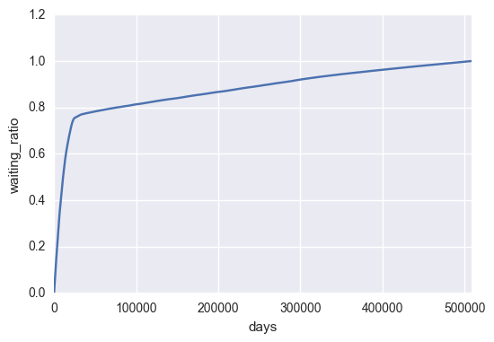
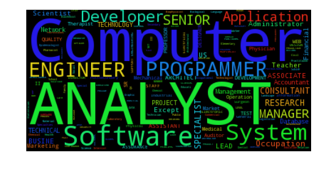

## REPORT FOR ENIGMA data science challenge

There are some intreresting questions come up my mind and I divided them into two parts, which are listed as follows:

### Predictive modeling:

- Who will get an H-1B? 

  Even H-1B is randomly selected by the government, the role of job and company still play some roles during the process. Here I want to build a model when you put information related to application to the model and it will return the probability that your application can be certified.

  First and foremost, clean the data but keep missing value in the data. Due to the fact that there is possibility that people submitting missing information. This information should be considered as inputs as well. Secondly, random forest model can be used as a classifier for this problem. It will return feature importance for  attributes and return the probability of being certified

  please see further information in Who_will_certified_the _H-1B.ipynb

### Exploratory Data Analysis

- How long should an employee work for a company

  There is certain deadline for H-1B applications. Through visualizing the application timeline, It can clear show you when is the right time to apply for the H-1B visa and How long you are going to wait, which is really important for foreign workers!

  
  
  From the figures, we can find out around 80% people wait no more than 100 days. Therefore, the applicant should expect the application result will be around 3 months. For further study, we should take the application result into account so we can understand that what normally the accepted result it is.

- Spatial Info visualization:

  spatial information can be visualized  by summarizing the city information. shapely, Fiona and geopandas can be used to discover the spatial pattern of the data.

- What kind of job should international search for? 

  jobs title and SOC code can provide information about what are the top applicants' job are. By using groupy by function. The plot can be easily generated. Moreover, Words can be also visualized by word cloud.

  
